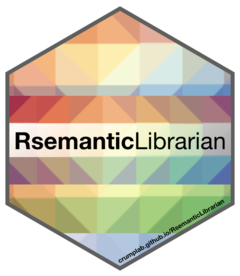
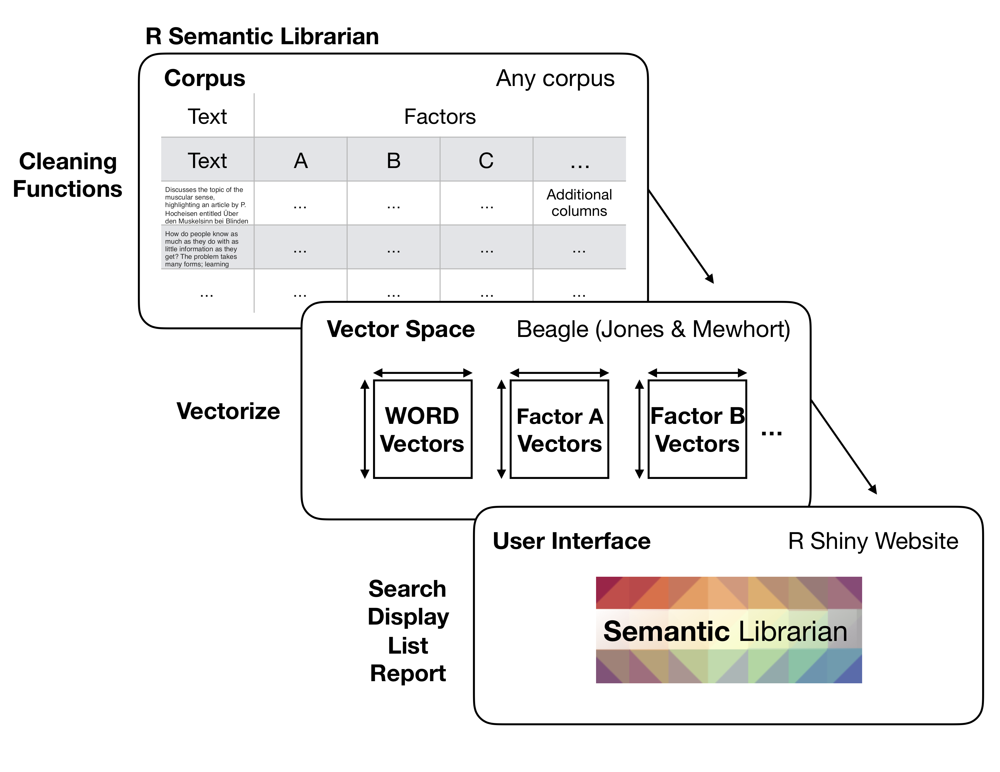

# RsemanticLibrarian 

<!-- badges: start -->
<!-- badges: end -->

## Installation

The devtools library is required for installation:

``` r
devtools::install_github("CrumpLab/RsemanticLibrarian")
```

## Overview

`RsemanticLibrarian` is a package of helper functions for creating and visual semantic spaces from text. The package is working, but is also under development. Please report issues in the github issues tab for this repository.

## What is the Semantic Librarian?

The Semantic Librarian project creates search engines using vector-space models of semantics. It converts words, sentences, and documents to points in a high-dimensional meaning space, where texts that are closer together are more similar in their semantic meaning. You can see examples of the search engines at <https://www.semanticlibrarian.com>. R shiny was used to build the search engine UI.

## Goals for this package

The general goal of RsemanticLibrarian is to provide R functions for creation, manipulation, and visualization of text-based semantic spaces. At the present time, these functions allow a user to vectorize a text corpus (using BEAGLE, Jones & Mewhort), and then calculate and display similarities between words, sentences, paragraphs, and other vectorized sources.

### Semantic Librarian for scientific abstracts

The Semantic Librarian was originally developed as a tool to search the database of APA (American Psychological Association) abstracts from the 1890s to 2016. As such, most the of the functions are written with scientific abstract data in mind. For example, the functions are intended to solve three kinds of problems, text cleaning, vector production, and graphical display and search:

</img>

### Semantic Librarian for any text

The Semantic Librarian presumably could have much wider use beyond searching scientific abstracts by semantic similarity. As such, a more general goal is to create functions that can vectorize any kind of text corpus, and produce semantic vectors at the level of words, and any additional factor that is desired.

</img>

Although this library is not yet optimized for producing semantic vectors from any text source, the intention is to produce minimal working examples for using these functions to accomplish such a goal. Currently, an example of this more general approach can be found here <https://github.com/CrumpLab/alice>. The "Alice" example inputs the book Alice and Wonderland as a text source. The data are converted to a dataframe as described above, with each sentence represented by a row. Then arbitrary factors are assigned as columns. For example, a column could represent the chapter the sentence was taken from, or the name of a character in the sentence, or any other factor. Then, the Alice example shows how vector spaces can be created for each word, sentence, and each factor. And, the resulting vector space is loaded into a Shiny app that allows a user to select items from a source vector space and search similar items in a target vector space.

## Examples of usage

Examples of using RsemanticLibrarian can be found in the articles tab. The plan is to keep adding additional examples of various use cases as we develop this package.

## About

### Collaborators

The Semantic Librarian project is a collaboration between [Matthew Crump](https://crumplab.github.io) (Brooklyn College of CUNY), [Harinder Aujla](http://ion.uwinnipeg.ca/%7Ehaujla/) (U of Winnipeg), and [Randall Jamieson](https://umcognitivesciencelaboratory.weebly.com) (U of Manitoba)

### Paper

Details can be found in: Aujla, H., Crump, M. J. C., Cook, M. T., & Jamieson, R. K. (2019). The Semantic Librarian: A search engine built from vector-space models of semantics. *Behavior Research Methods*, https://doi.org/10.3758/s13428-019-01268-4.

Open science project: [https://osf.io/wfcmg/](https://osf.io/wfcmg/)

